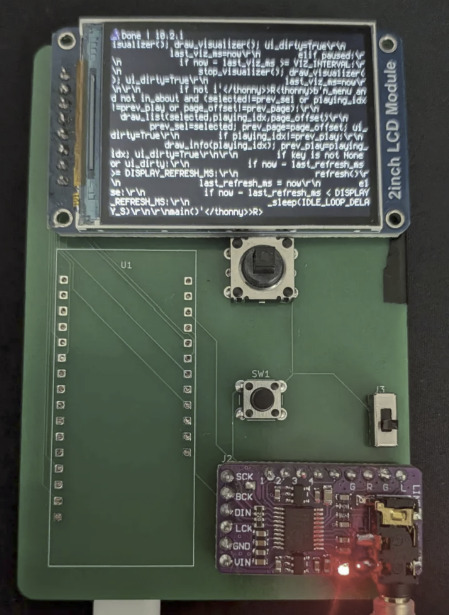
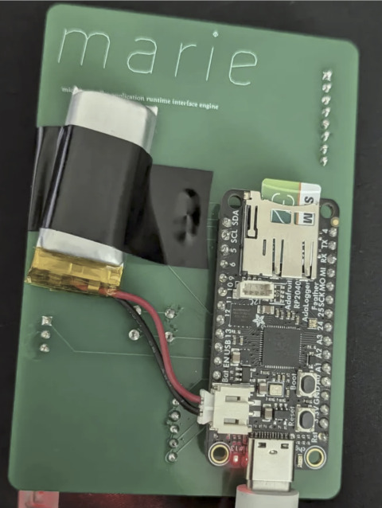
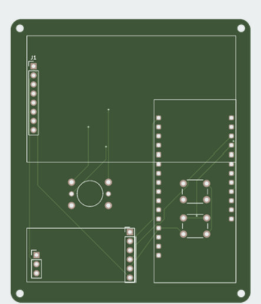
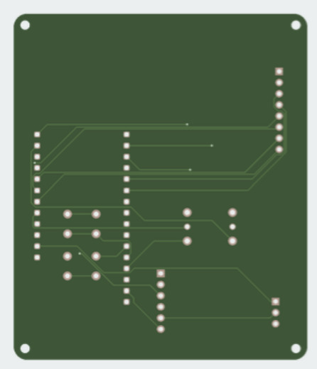
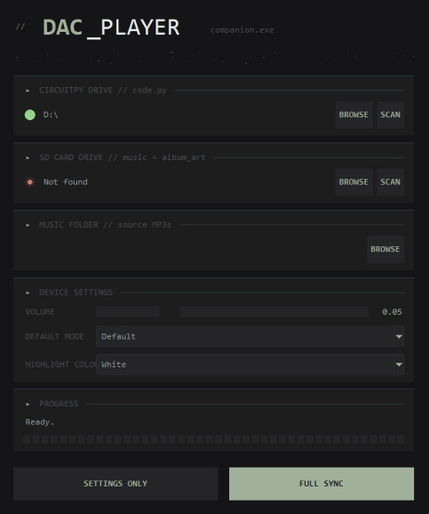

# m.a.r.i.e - Microcontroller Application Runtime Interface Engine

A custom-built handheld media platform for the RP2040, featuring a graphical UI, SD-card-backed music playback, album art rendering, an animated audio visualizer, and a companion desktop application that automates asset conversion and deployment.

<p align="center">
  
  
</p>

## Project History

This project began as a simple RP2040-based MP3 player. During development it moved from MicroPython to **CircuitPython**, primarily because CircuitPython exposes the onboard flash and SD card as a native, host-mountable filesystem (`CIRCUITPY` drive) rather than requiring a serial bridge (e.g. `ampy`, `rshell`, or a REPL-based transfer) to move files on and off the device, as is typically necessary in MicroPython. That single change - direct, drag-and-drop-style storage access - turned out to be the difference between "a project that plays MP3s" and "a project that can run *any* small application that needs persistent storage."

As a result, the scope grew: song/metadata handling, album art, a settings menu, theming, and a full companion app for asset generation were added incrementally. What's shipped today is closer to a lightweight application runtime for the RP2040 than a single-purpose music player - hence the rename to **m.a.r.i.e** (Microcontroller Application Runtime Interface Engine). The music player is the first application built on top of it; the long-term goal is to use the same hardware/firmware base for other small on-device applications (games, utilities, etc. - see [Roadmap](#roadmap--future-features)).

## Key Features

- Graphical UI with paginated song list, album art panel, and playback progress bar
- Album artwork rendering from preconverted RGB565 `.raw` files, streamed directly to the display over SPI
- Real-time animated audio visualizer (integer-only, no floating-point math)
- Multiple playback modes: Default, Shuffle, Loop
- On-device settings menu (Volume, Play Mode, Highlight Color, About)
- 8 selectable UI accent colors, applied live across the interface
- SD card storage for music (`.wav`) and album art (`.raw`), with onboard flash used for firmware/UI code
- LiPo battery support with USB-C charging (via the Feather RP2040 Adalogger's onboard charge circuit)
- Companion desktop app (Windows/macOS/Linux) that:
  - Extracts ID3 metadata and embedded album art from a folder of MP3s
  - Transcodes audio to device-ready WAV
  - Converts album art to fixed-size RGB565 `.raw` images
  - Auto-generates the on-device song table and pushes it to the CircuitPython runtime
  - Can push device settings (volume/mode/color) independently of a full song resync

## Hardware

### Bill of Materials

| Component | Role |
|---|---|
| Adafruit Feather RP2040 Adalogger (8MB flash, onboard microSD) | Main microcontroller, storage, LiPo charging |
| Waveshare 2" IPS LCD, 240×320, SPI (ST7789 driver) | Display |
| PCM5102 / PCM5102A I2S DAC module | Audio output |
| LiPo battery | Power |
| Thru-hole 5-way navigation switch | Primary UI navigation (up/down/left/right/select) |
| 2× push buttons | Mode button, Extra/auxiliary button |
| 1× slide/toggle switch | Hardware power on/off |
| Custom PCB (see `/pcb`) | Integrates all of the above |

### Wiring

**Audio - PCM5102 I2S DAC**

| DAC Pin | Feather Pin |
|---|---|
| VIN | 3V |
| GND | GND |
| LRCK | D5 |
| DIN | D6 |
| BCK | D4 |

**Display - ST7789 SPI**

| Display Pin | Feather Pin |
|---|---|
| VCC | 3V |
| GND | GND |
| DIN | MOSI |
| CLK | SCK |
| CS | D13 |
| DC | D10 |
| RST | D9 |
| BL | D11 |

**5-Way Navigation Switch**

| Switch Pin | Feather Pin |
|---|---|
| Common (pin 4) | GND |
| Center / Select (pin 6) | D12 |
| Position A | SDA |
| Position B | TX |
| Position C | SCL |
| Position D | RX |

**Mode Button**

| Pin | Feather Pin |
|---|---|
| GND | GND |
| OUT | A0 |

**Extra / Auxiliary Button**

| Pin | Feather Pin |
|---|---|
| GND | GND |
| OUT | A1 |

**Power Switch**

| Pin | Feather Pin |
|---|---|
| Middle | GND |
| Top | EN |

> **Note on button mapping:** the firmware (`main.py`) assigns UP/DOWN/PLAY/PREV/NEXT/MODE to specific GPIOs, which in turn correspond to specific Feather pin labels (confirmed against the Adalogger's pinout). Cross-referencing the wiring above against the firmware's `PIN_BTN_*` constants shows that the physical switch legs don't currently line up 1:1 with their printed direction - e.g. the leg wired to SDA drives the firmware's "Play/Select" action rather than "Up," and the center leg (D12) drives "Next" rather than "Select." This isn't necessarily wrong, but worth double-checking against your PCB silkscreen before final assembly - either the wiring or the `btn_map` tuple in `main.py` can be adjusted to match your intended layout.

### PCB Notes

<p align="center">
  
  
</p>

- Custom PCB files are included in the repository (`/pcb`).
- The 5-way navigation switch requires a **custom footprint** - reference the footprint used in the included PCB files rather than a generic through-hole 5-pin part.
- Route DAC ground with a short, low-impedance path back to system ground to suppress static/noise on the analog output.

## SD Card Layout

The SD card must contain exactly two top-level folders for the runtime and companion app to function:

```
/music/        # Converted .wav audio files
/album_art/    # Converted .raw (RGB565) album art files
```

The companion app creates these automatically during a sync if they don't already exist.

## Software Architecture

The project has two components: firmware that runs on the device, and a desktop companion app that prepares assets and deploys them to the device.

### 1. Device Runtime (`main.py`)

Runs on the RP2040 under CircuitPython.

**Responsibilities:**
- Initializes and drives the ST7789 display, PCM5102 I2S DAC (via `audiomixer`/`audiocore`), and SD card over SPI
- Renders the full UI: paginated song list, album art panel, visualizer, progress bar, and now/playing info
- Handles all input via debounced GPIO reads (buttons only - no serial/REPL input path in the runtime loop)
- Manages playback state: selected vs. currently playing song, pause/resume, auto-advance on track end, Shuffle/Loop/Default modes
- Provides an on-device settings menu (Volume, Play Mode, Highlight Color, About) navigable with the same controls used for playback
- Applies the selected highlight color live across the progress bar, visualizer, and text labels
- Loads a boot splash (`logo.bmp`) recolored to the active highlight color before mounting the SD card

**Playback pipeline:**
- Songs are stored as pre-converted 44.1kHz, 16-bit, stereo PCM `.wav` files on the SD card - the RP2040 does not decode MP3 in real time
- Album art is stored as pre-converted, fixed-size RGB565 `.raw` binary files and blitted directly to the display via raw SPI column/row-address commands, bypassing `displayio` bitmap allocation for that asset
- The song table (`SONGS`), default volume, default playback mode, and default highlight color are all firmware constants generated/updated by the companion app rather than edited by hand

### 2. Companion App (Desktop, Tkinter GUI)

Runs on a computer as a build/deploy step. Automates everything that the RP2040 is too resource-constrained to do on-device.

<p align="center">
  
</p>

**Responsibilities:**
- Scans a folder of `.mp3` files and extracts, via `mutagen`:
  - Song title, artist, and duration
  - Embedded album artwork (ID3 `APIC` frame)
- Converts audio via `ffmpeg` to 44.1kHz / 16-bit / stereo PCM `.wav`
- Converts album art via `Pillow`: center-crops to square, resizes to a fixed resolution, and packs it into RGB565 `.raw` format matching the display's native pixel format
- Auto-detects the `CIRCUITPY` drive and an SD card drive (by volume label or by folder-content matching for `music`/`album_art`) - automatic detection is Windows-only; manual folder selection works on any OS
- Two sync modes:
  - **Full Sync** - converts and copies all audio/art, regenerates the on-device song table, and writes it into `main.py` on the `CIRCUITPY` drive
  - **Settings Only** - patches volume/mode/color constants directly into `main.py` without touching songs or requiring re-conversion
- Runs all conversion/copy work on a background thread with live log and progress feedback in the GUI

## Memory & Performance Optimizations

Both the runtime and the companion app were written with the RP2040's limited RAM in mind. Notable techniques:

- **Offloaded decoding**: MP3 decoding and image resizing/cropping happen on the host machine, not the microcontroller - the RP2040 only ever handles pre-decoded PCM audio and pre-sized RGB565 pixel data.
- **Direct-to-display blitting**: Album art is streamed row-by-row straight to the display controller via raw SPI commands, avoiding the memory overhead of allocating a full-size `displayio` bitmap for a large image.
- **Dirty-state rendering**: The song list, visualizer, and progress bar all track their previous render state and only redraw the pixels/rows/labels that actually changed, rather than doing a full redraw every frame - this reduces both SPI bus traffic and CPU time.
- **Integer-only math**: The visualizer and progress bar use exclusively integer arithmetic ("zero-float" implementations) since floating-point operations are comparatively expensive on this class of microcontroller.
- **Aggressive use of `const()`**: Fixed values (pin assignments, screen geometry, color values, mode indices, etc.) are wrapped in `const()` so they're folded in at compile time rather than stored as mutable variables, reducing RAM usage.
- **Explicit garbage collection**: `gc.collect()` is called at key transition points (after UI construction, around audio start/stop, after the boot splash) to reduce heap fragmentation.
- **Tuned audio buffers**: I2S and mixer buffer sizes are fixed and sized to avoid underruns without over-allocating RAM.
- **No serial input path in the runtime loop**: All input is polled directly from GPIO buttons; the main loop does not parse or wait on serial/REPL input, which both saves RAM and avoids USB-driven timing hiccups during playback.
- **Throttled display refresh**: The display is only refreshed when something changed (input or a dirty UI flag), and refreshes are rate-limited, rather than refreshing on a tight fixed interval regardless of need.

## Getting Started

### Flashing CircuitPython (UF2)

The Feather RP2040 Adalogger ships with CircuitPython support via a UF2 bootloader. To install or update CircuitPython:

1. Download the latest CircuitPython UF2 for **Adafruit Feather RP2040 Adalogger** from [circuitpython.org/downloads](https://circuitpython.org/downloads).
2. Put the board into bootloader mode:
   - Press and hold the **BOOT** button on the board.
   - While still holding BOOT, plug the board into USB (or press **RESET** if it's already connected).
   - Release BOOT once connected. The board will appear as a USB mass storage drive named `RPI-RP2`.
3. Drag and drop the downloaded `.uf2` file onto the `RPI-RP2` drive.
4. The board will automatically reboot and re-mount as a `CIRCUITPY` drive. This confirms CircuitPython is installed and ready.
5. Copy the required CircuitPython libraries (see below) and `main.py` onto the `CIRCUITPY` drive.

> Re-flashing a UF2 only replaces the CircuitPython firmware itself; it does not erase files already on the `CIRCUITPY` drive, but it's still good practice to back up `main.py` and any libraries before updating.

### Requirements - Device

- CircuitPython installed on the Adafruit Feather RP2040 Adalogger
- CircuitPython libraries: `adafruit_st7789`, `adafruit_display_text`
- An SD card formatted with `/music` and `/album_art` folders (see [SD Card Layout](#sd-card-layout))

### Requirements - Companion App

- Python 3
- [`ffmpeg`](https://ffmpeg.org/) installed and available on your system `PATH`
- Python packages:
  ```
  pip install mutagen Pillow
  ```
- `tkinter` (bundled with most standard Python installs)

### Basic Workflow

1. Flash CircuitPython onto the board (see [Flashing CircuitPython](#flashing-circuitpython-uf2)) and copy `main.py` and the required libraries to the `CIRCUITPY` drive.
2. Insert an SD card with `/music` and `/album_art` folders into the Adalogger's onboard slot.
3. Connect the device via USB and launch the companion app.
4. Select your MP3 source folder, confirm the detected (or manually browsed) `CIRCUITPY` and SD drives.
5. Adjust default Volume / Play Mode / Highlight Color if desired.
6. Run **Full Sync** for a first-time setup or when songs have changed, or **Settings Only** to push settings changes without re-processing audio/art.

## Controls

| Input | Function (playback) | Function (menu) |
|---|---|---|
| Up / Down | Move song selection, scroll pages | Change menu selection |
| Left / Right | Skip previous / next track | Adjust selected setting |
| Select (center) | Play / pause selected song | Confirm / enter submenu |
| Mode | Open settings menu | Close menu, return to player |
| Extra | *Reserved - not yet mapped in firmware* | *Reserved - not yet mapped in firmware* |
| Power switch | Hardware on/off | - |

## Roadmap / Future Features

- **Persistent settings**: retain selected theme, volume, and playback mode across power cycles (currently these are baked in as firmware constants at sync time)
- **Song statistics**: track play counts and recency per song, stored to a flash-resident text file (no RTC is present, so statistics will be relative/count-based rather than timestamped)
- **Further serial/REPL trimming**: continue reducing any remaining serial/USB-console overhead to reclaim additional RAM
- **Optional visualizer removal**: allow disabling the audio visualizer in favor of static play/pause icons on more memory-constrained builds
- **Settings/memory wipe**: a reset path to clear stored settings and return to defaults
- **Additional on-device applications**: leveraging the free GPIO, storage, and display already available, e.g. simple games (Snake) or utility tools - the original motivation for the m.a.r.i.e rename